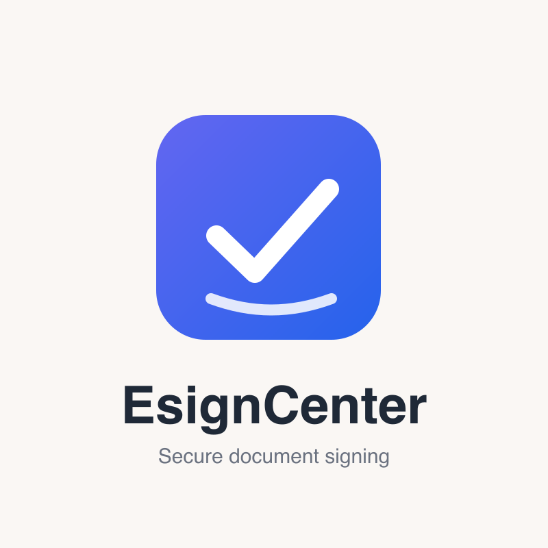

# EsignCenter

EsignCenter is a self-hosted document signing platform. Create PDF forms, have them filled and signed online on any device, and integrate e-signing into your own applications through an API — all running on your own server, with no per-document fees.



## About this project

EsignCenter is a customized fork of [DocuSeal](https://www.docuseal.com) ([source repository](https://github.com/docusealco/docuseal)), licensed under the AGPL-3.0. In accordance with the license:

- It retains the required DocuSeal attribution in the user interface (see [LICENSE_ADDITIONAL_TERMS](LICENSE_ADDITIONAL_TERMS)).
- The complete source code of this modified version is available in this repository, as required by section 13 of the AGPL.

## Features

- PDF form fields builder (WYSIWYG)
- 12 field types available (Signature, Date, File, Checkbox etc.)
- Multiple submitters per document
- Automated emails via SMTP
- Files storage on disk or AWS S3, Google Storage, Azure Cloud
- Automatic PDF eSignature
- PDF signature verification
- Users management with admin/editor/viewer roles
- Custom company logo on signing pages and app header
- Automated email reminders to incomplete signers
- Template creation from PDFs/images via API (`POST /api/templates`)
- Embedded signing sessions and embedded template builder sessions for your own apps
- Mobile-optimized
- 7 UI languages with signing available in 14 languages
- API and Webhooks for integrations
- Easy to deploy in minutes

See the [docs](docs/) directory for API and embedding guides.

## Self-hosting

EsignCenter is built from the source in this repository (there is no prebuilt public Docker image for this fork).

#### Docker

Build the image and run it:

```sh
docker build -t esigncenter .
docker run --name esigncenter -p 3000:3000 -v.:/data esigncenter
```

By default the docker container uses an SQLite database to store data and configurations. Alternatively, it is possible to use PostgreSQL or MySQL databases by specifying the `DATABASE_URL` env variable.

#### Docker Compose

Build the image as above, then use the [docker-compose.yml](docker-compose.yml) in this repository (point its `image:` at your locally built `esigncenter` image).

Run the app under a custom domain over https using docker compose (make sure your DNS points to the server to automatically issue ssl certs with Caddy):

```sh
sudo HOST=your-domain-name.com docker compose up
```

#### Local development

For local development with hot reload, see [docs/local-development-hotreload.md](docs/local-development-hotreload.md).

For a fast local preview with production-mode Rails and precompiled assets, see
[docs/local-production-preview.md](docs/local-production-preview.md).

## License

Distributed under the AGPLv3 License with Section 7(b) Additional Terms. See [LICENSE](LICENSE) and [LICENSE_ADDITIONAL_TERMS](LICENSE_ADDITIONAL_TERMS) for more information.

Modifications © 2026 EsignCenter.
Unless otherwise noted, all files © 2023-2026 DocuSeal LLC.
